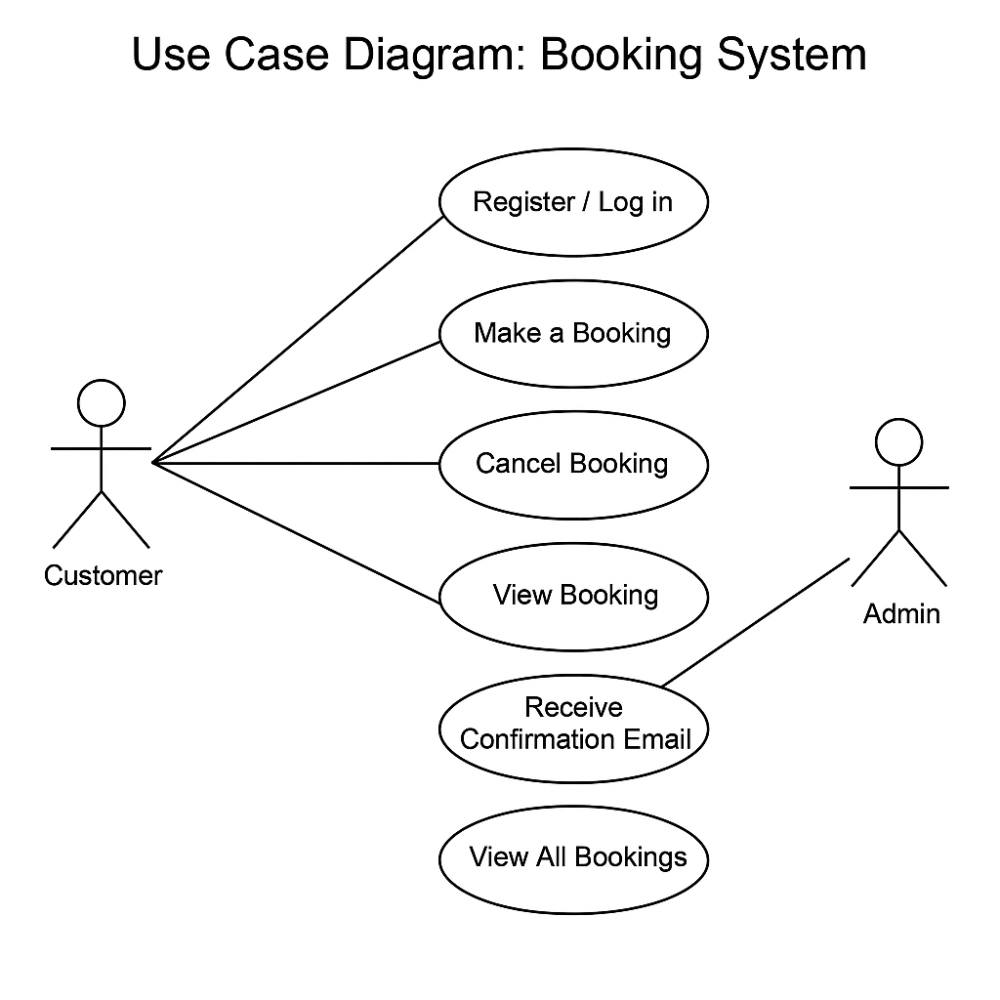

# Requirement Analysis in Software Development

- This repository is dedicated to documenting the process of requirement analysis in software development. 
- It includes key concepts, steps, and deliverables that help in understanding how software requirements are gathered, analyzed, modeled, and validated. 
- The goal is to provide a clear, organized guide for students and professionals working on software engineering projects.

## What is Requirement Analysis?

- Requirement Analysis is a crucial phase in the Software Development Life Cycle (SDLC) that involves identifying, gathering, analyzing, and documenting the needs and expectations of stakeholders for a software system. It acts as the foundation for all subsequent phases of development, ensuring that the final product aligns with user requirements and business goals.

- This process helps developers and stakeholders reach a mutual understanding of what the software should do, how it should behave, and any constraints or conditions it must meet. Effective requirement analysis reduces the risk of project failure, minimizes costly rework, and improves customer satisfaction.

### Importance in SDLC:
- **Improves clarity and understanding:** Helps bridge the communication gap between stakeholders and developers.
- **Guides design and development:** Provides a clear foundation for creating system architecture and features.
- **Supports project planning:** Helps estimate time, cost, and resources required for the project.
- **Reduces risks and errors:** Identifies inconsistencies or missing requirements early.
- **Facilitates validation and verification:** Ensures the final product meets user needs and expectations.

## Why is Requirement Analysis Important?

Requirement Analysis is one of the most critical activities in the Software Development Life Cycle (SDLC). It lays the groundwork for successful project execution by ensuring all stakeholders have a shared understanding of what the software should accomplish. Below are key reasons why this phase is essential:

### 1. Prevents Miscommunication
By thoroughly analyzing and documenting requirements, teams avoid misunderstandings between clients, developers, and other stakeholders. This clarity ensures that everyone is on the same page regarding expectations and deliverables.

### 2. Saves Time and Cost
Identifying and resolving requirement issues early in the process is far less expensive than correcting them during development or after deployment. Proper analysis reduces the need for major revisions and rework.

### 3. Improves Product Quality
A well-analyzed set of requirements helps developers build software that truly meets user needs. It ensures the system behaves as expected, which enhances user satisfaction and product reliability.

### 4. Facilitates Better Planning
Clear requirements help project managers estimate timelines, allocate resources effectively, and plan milestones accurately.

### 5. Aids in Risk Management
Requirement analysis helps in identifying potential risks early, allowing teams to develop mitigation strategies before those risks impact the project.

## Key Activities in Requirement Analysis

The Requirement Analysis process consists of several structured activities that help ensure software requirements are clear, complete, and accurate. Below are the five key activities involved:

- **Requirement Gathering**  
  This involves collecting high-level requirements from stakeholders, clients, and users. It focuses on understanding what the stakeholders expect from the software system.

- **Requirement Elicitation**  
  A deeper, more interactive process that uses techniques such as interviews, workshops, surveys, and observation to uncover detailed and hidden requirements.

- **Requirement Documentation**  
  All gathered and elicited requirements are clearly documented in a structured format (e.g., Software Requirements Specification - SRS) to serve as a reference for both stakeholders and the development team.

- **Requirement Analysis and Modeling**  
  This step involves examining the requirements for clarity, completeness, and feasibility. It may include modeling them using diagrams such as use cases, flowcharts, or data models to better visualize the system.

- **Requirement Validation**  
  Ensures that the documented requirements accurately reflect the needs of stakeholders. This step checks for correctness, completeness, and alignment with business goals, often involving reviews and walkthroughs with stakeholders.

## Types of Requirements

In software development, requirements are generally categorized into two main types: **Functional Requirements** and **Non-functional Requirements**. Understanding both is essential for designing systems that not only work correctly but also perform efficiently and meet user expectations.

### Functional Requirements

Functional requirements define **what the system should do**. These describe the specific behaviors, tasks, or functions the system must support.

**Examples for a Booking Management Project:**
- Users can create, view, update, or cancel bookings.
- The system should send booking confirmation emails to customers.
- Admin users can manage available time slots and service providers.
- Users must log in or register before making a booking.
- The system should prevent double booking of the same time slot.

### Non-functional Requirements

Non-functional requirements define **how the system should perform**. They focus on quality attributes such as performance, usability, security, and reliability.

**Examples for a Booking Management Project:**
- The system should load booking pages within 2 seconds.
- User data and bookings must be protected using encryption.
- The application should support up to 500 concurrent users.
- The system should be available 99.9% of the time (high availability).
- The user interface should be responsive and work across desktop and mobile devices.

## Use Case Diagrams

A **Use Case Diagram** is a visual representation of the interactions between users (actors) and the system. It helps identify what the system should do (its use cases) and who interacts with it. Use case diagrams are especially useful in requirement analysis to define system scope and capture high-level user interactions.

### 🔍 Benefits of Use Case Diagrams:
- Provides a clear understanding of system functionality.
- Helps identify different types of users (actors).
- Supports communication between technical and non-technical stakeholders.
- Assists in planning test cases and development tasks.

##alx-booking-uc.png

Below is a use case diagram illustrating the core interactions for a booking management system:

# Requirement Analysis for Booking Management System

## Project Overview
This repository contains the requirement analysis documentation for the Booking Management System. The goal of this project is to define clear requirements and acceptance criteria for features to be developed in the system, ensuring that the product meets the users' needs and expectations.

## Features
The main features include:
- User authentication
- Booking management
- Payment processing
- Notifications (email, SMS)
- Reporting and analytics

## Acceptance Criteria

### Importance of Acceptance Criteria in Requirement Analysis
Acceptance Criteria are a critical part of requirement analysis as they define the conditions that a feature must meet to be considered complete and functioning. These criteria help ensure that:
- The product meets the desired quality.
- Development aligns with the project goals.
- Testing can be conducted effectively and results can be validated.

With clear Acceptance Criteria, both stakeholders and the development team can be certain about what constitutes a "done" feature. This reduces ambiguity, scope creep, and allows for efficient progress tracking.

### Example: Checkout Feature in a Booking Management System
For the **Checkout** feature, the Acceptance Criteria could be as follows:

- **AC1:** The system must display a summary of the booking before finalizing the payment. The summary should include:
  - Booking dates
  - Location details
  - Price
  - User details

- **AC2:** The user must be able to enter and validate their payment details (credit card, PayPal, etc.).

- **AC3:** Upon successful payment, the user should:
  - Receive a confirmation message on the screen.
  - Get a receipt with booking details sent via email.

- **AC4:** If the payment fails, the system should show an error message specifying the reason for the failure (e.g., insufficient funds, invalid card details).

- **AC5:** The system should support multiple currencies, automatically converting the amount based on the user's location.

- **AC6:** The system should update the availability of rooms/services once the booking is confirmed.

- **AC7:** The checkout process should complete within 5 minutes; otherwise, the booking should be canceled.

### How to Use the Acceptance Criteria
These criteria will be used by the development and quality assurance teams to:
- Guide the development process.
- Test whether the system works as expected.
- Ensure the final product aligns with user needs and business goals.

By following these Acceptance Criteria, we ensure the quality of the checkout feature in the Booking Management System.

